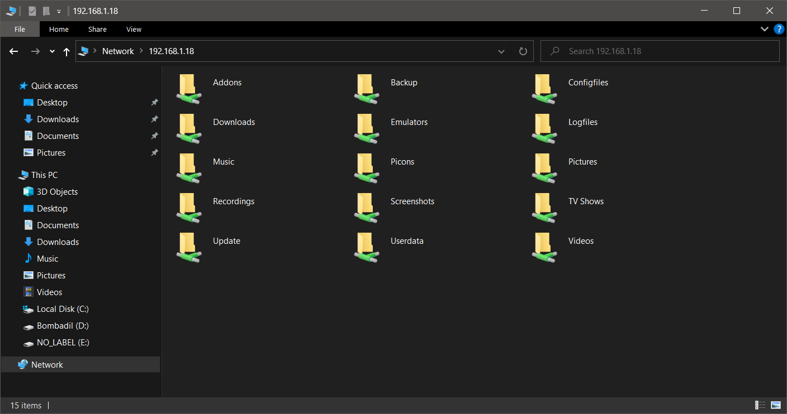
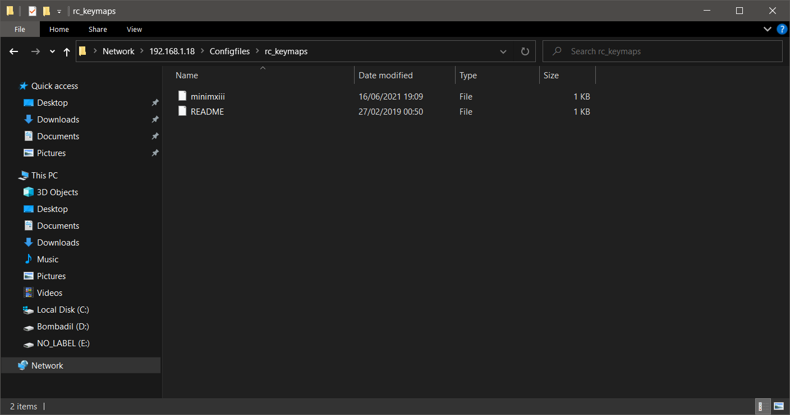
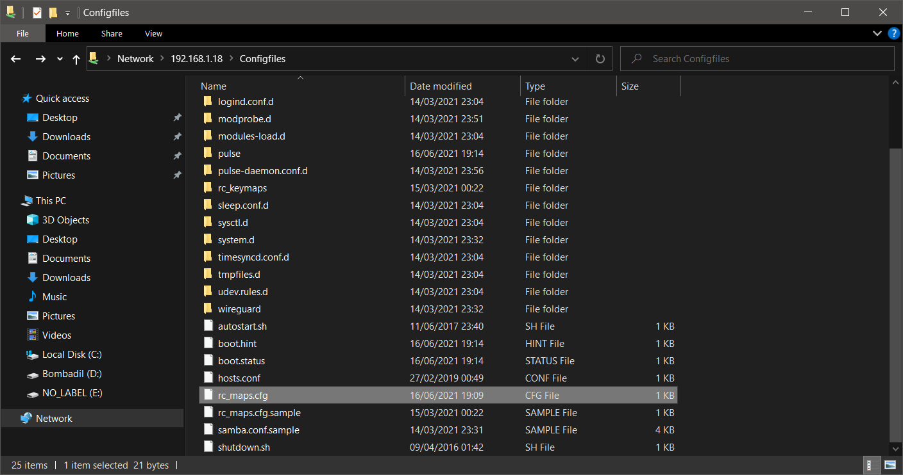

# MiniMXIII
All things CoreElec for my MiniMX III

## Whats this about?
This will serve as my own repository for all the files i need to boot and get CoreElec up and running on my MiniMX III. No piece of sofware was created or modified by me. All credits to the rightful people in particular the amazing CoreElec team and volunteers.

## What's in this repository
1. DTB files for the different versions of the MiniMX III
2. Remote control file - To make the original remote work after installing CoreElec

# Remote control
## Instructions providing you enable Samba on your box

1. Access your MiniMX via file browser i.e.:

2. Copy the minimxiii file to the folder rc_keymaps

3. Copy the rc_maps file to the folder Configfiles

4. Reboot your MiniMX

Original files for a huge number of boxes can be found here: http://bit.ly/RmtFilesCE

